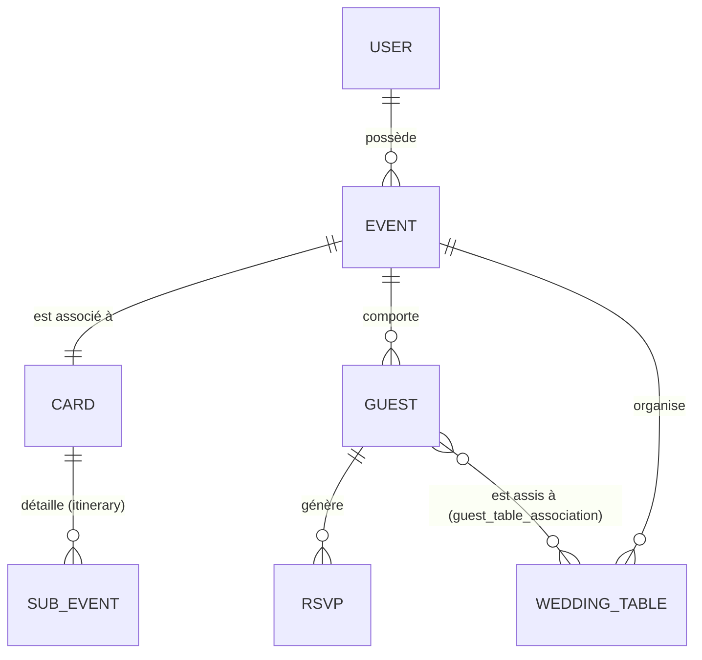

# Dossier Technique : Wedding Invitation SaaS

Ce document présente la modélisation et la conception du backend pour la plateforme de gestion de mariages.

---

## 1. Modèle Métier (Entities & Relations)

Le système est conçu autour de 6 entités principales interconnectées :

1.  **User** : L'organisateur qui possède un compte et peut gérer plusieurs événements.
2.  **Event** : L'entité centrale (le mariage). Il regroupe toutes les données logistiques (date, lieu, noms des mariés).
3.  **Card** : La vitrine numérique de l'événement. Elle stocke la personnalisation visuelle, les textes d'introduction et l'état de publication.
4.  **Guest** : L'invité, rattaché à un événement. Il possède un statut de réponse (confirmed, declined, pending).
5.  **RSVP** : L'historique des réponses. Un invité peut répondre plusieurs fois (mise à jour), mais seul le dernier état est reflété sur l'entité Guest.
6.  **WeddingTable** : Les tables pour l'organisation de la salle, rattachées à un événement.

---

## 2. Schéma des Entités et Relations (ERD)

---

## 3. Justification des choix de conception

### Relation Guest <-> WeddingTable (N-N)
Bien qu'en pratique un invité ne soit assis qu'à une seule table, nous avons utilisé une table d'association (`guest_table`).
- **Évolutivité** : Permet de gérer des événements complexes où un invité pourrait avoir plusieurs places (ex: dîner vs brunch le lendemain).
- **Implémentation actuelle** : Le code backend impose une contrainte métier "1 place maximum" en vidant la liste `assigned_tables` avant chaque nouvelle affectation, garantissant ainsi la cohérence des données tout en gardant une structure flexible.

### Séparation Event / Card
Nous avons séparé les données logistiques (`Event`) des données de présentation (`Card`).
- **Réutilisabilité** : Un même événement pourrait théoriquement avoir plusieurs cartes (ex: une carte pour le vin d'honneur, une autre pour le dîner).
- **Public vs Privé** : La `Card` expose uniquement les informations nécessaires aux invités via un `slug` unique, protégeant ainsi les données sensibles de l'organisateur.

### Historique RSVP
Chaque réponse est stockée dans une table `RSVP` dédiée.
- **Audit** : Permet à l'organisateur de voir l'évolution des réponses.
- **Intégrité** : Le statut de l'invité (`Guest.rsvp_status`) est mis à jour de façon atomique lors de chaque nouveau RSVP.

---

## 4. Flux RSVP (Guest Flow)

1.  **Accès** : L'invité accède à l'URL `.../card/{slug}`.
2.  **Vérification** : Le backend vérifie si la carte est **publiée**. Si elle est en brouillon, aucune donnée n'est renvoyée et le RSVP est bloqué.
3.  **Identification** : L'invité saisit son nom/prénom.
4.  **Traitement** :
    - Si l'invité existe déjà dans la liste (pré-enregistré par l'organisateur), ses infos sont mises à jour.
    - S'il n'existe pas, un nouvel invité est créé (si le forfait de l'organisateur le permet).
5.  **Persistance** : Une entrée `RSVP` est créée, et le statut de `Guest` passe à `confirmed` ou `declined`.

---

## 5. Logique d'affectation des invités aux tables

L'affectation repose sur trois piliers de validation :

1.  **Propriété** : L'organisateur ne peut affecter que des invités lui appartenant à des tables qu'il possède.
2.  **Cohérence d'événement** : Une vérification stricte (`table.event_id == guest.event_id`) empêche d'affecter un invité du Mariage A à une table du Mariage B, même si l'organisateur possède les deux.
3.  **Capacité** : Le backend compte le nombre actuel d'invités liés à la table via la relation `secondary` et rejette l'affectation si la `capacity` est atteinte.

---

## 6. Endpoints Métier non-CRUD

- `POST /cards/{id}/publish` : Gère le cycle de vie de l'invitation (génération de slug, validation de l'état).
- `GET /guests/event/{id}/summary` : Agrégation de données pour aide à la décision.
- `GET /table/event/{id}/status` : Calcul en temps réel de l'état de remplissage de la salle.
